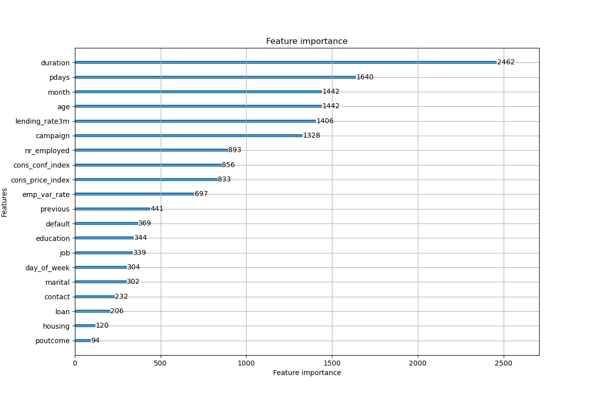

# machine-learning

Implementation of [bank customer subscription product forecast](https://tianchi.aliyun.com/competition/entrance/531993/information)


## data

| document       | size  | usage                                         |
| -------------- | ----- | --------------------------------------------- |
| train.csv      | 2MB   | train, including 20 features and labels       |
| test.csv       | 901KB | test , including 20 features without labels   |
| submission.csv | 73KB  | submit, including user id and predict results |


## run

```
python main.py
```


## feature importance




## score

| model          | parameters                            | predict (yes / no) | cross_val_score | submit score | rank |
| -------------- | ------------------------------------- | ------------------ | --------------- | ------------ | ---- |
| LGBMClassifier | n_estimators=525,  learning_rate=0.01 | 507  / 6993        | 0.8823          | 0.9665       | 103  |

